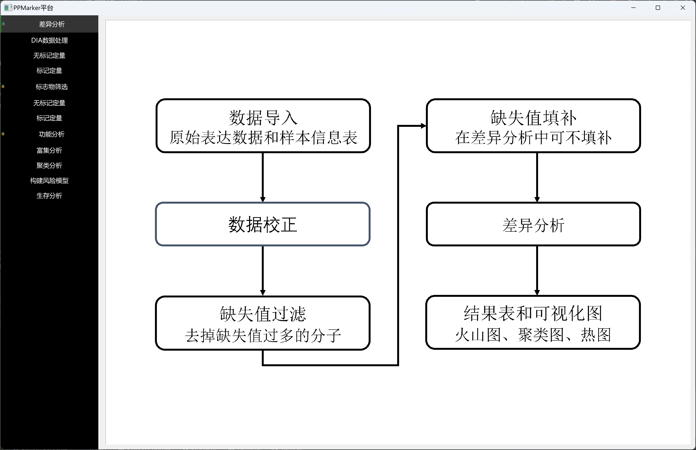
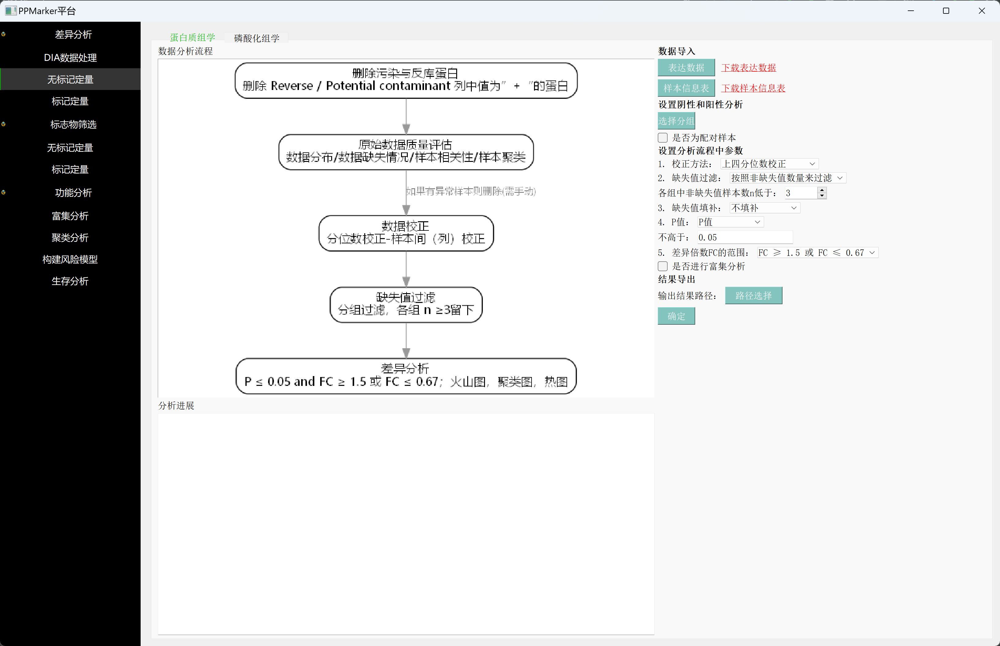
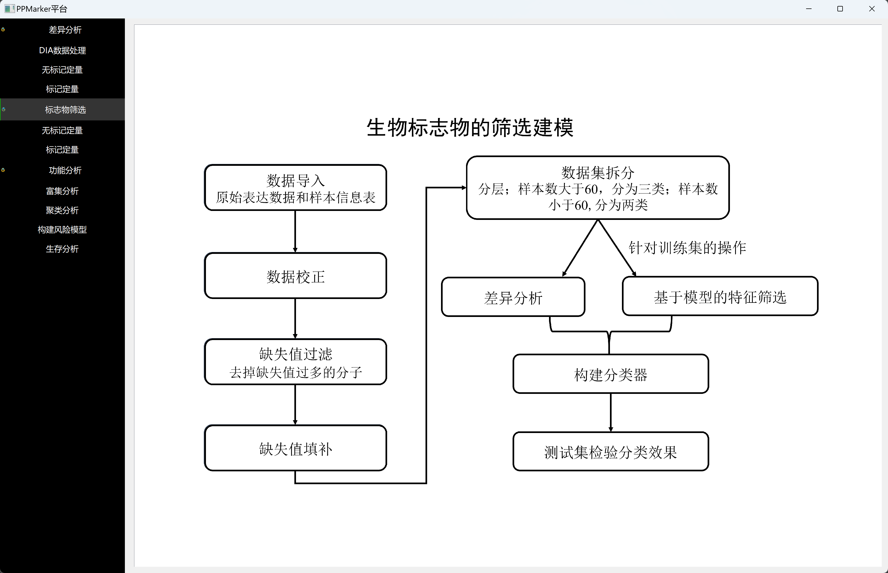
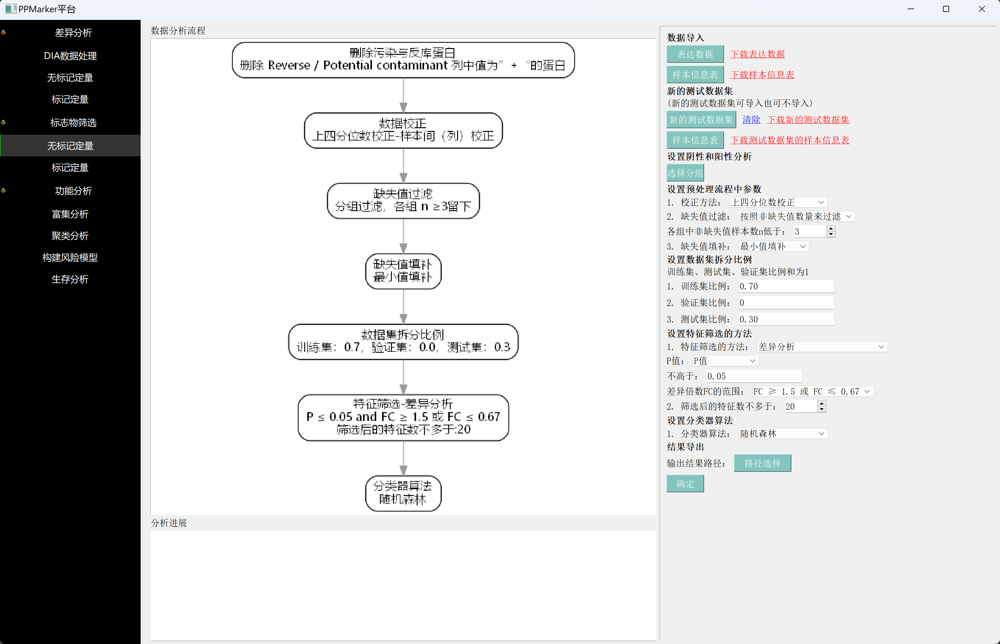
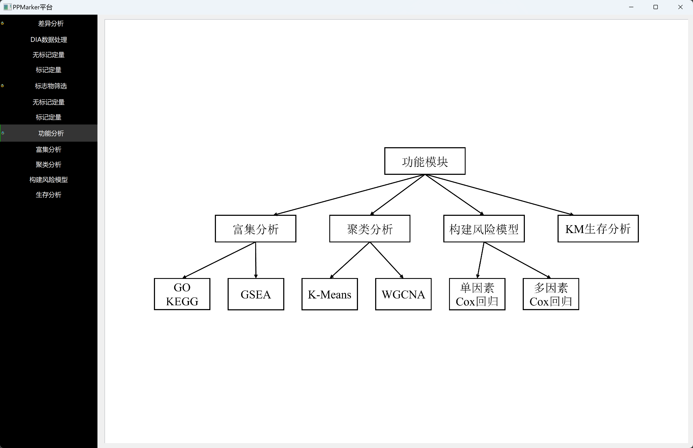
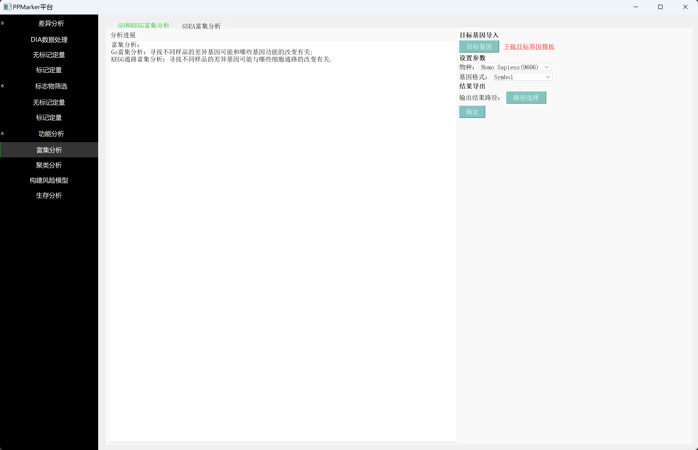
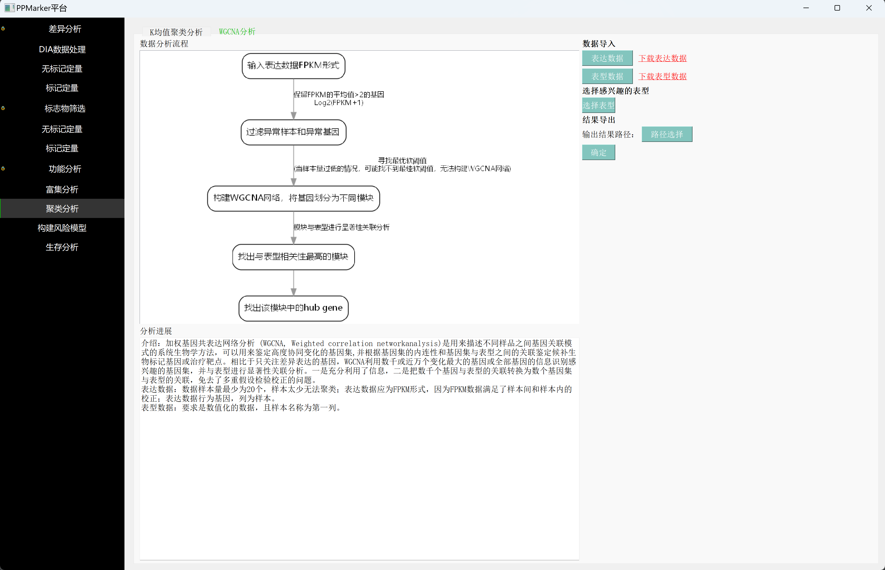
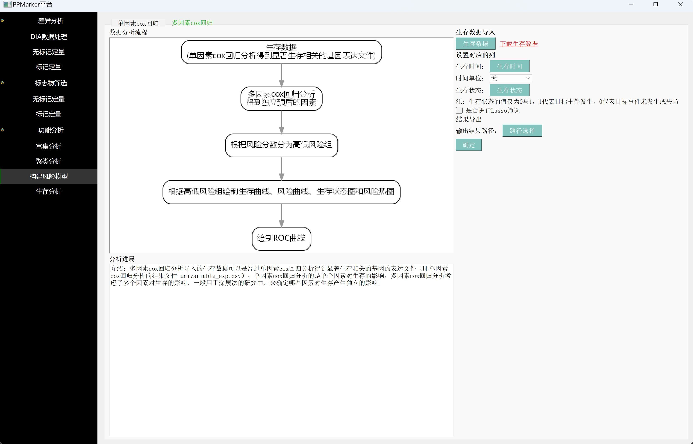
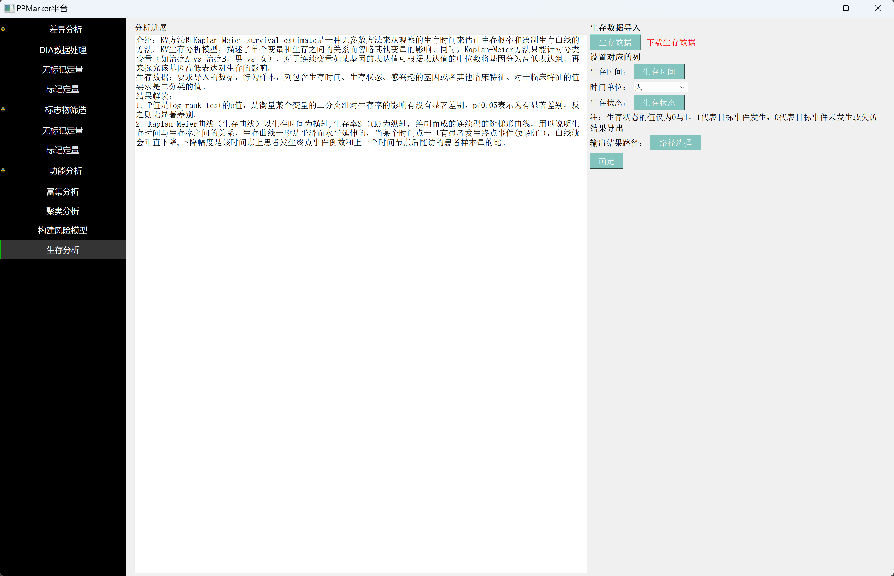

PPMarker平台
===


# 一、平台介绍

本项目是多组学数据分析的平台——PPMarker，平台包含三大模块：差异分析模块、生物标志物模块和功能分析模块，涵盖了生物组学数据分析的大部分功能。

## 1. 差异分析模块       

差异分析模块提供了完整的差异分析流程，包括四个分析步骤：原始数据评估、数据校正、缺失值的过滤与填补、统计检验得到差异表达的基因或蛋白质，每个分析步骤都会生成对应的图和表。

## 2. 生物标志物模块      

生物标志物模块提供了一套完整的生物标志物筛选、建模与验证的流程，具体的分析步骤有：数据预处理、数据集拆分、特征筛选、构建分类器和模型验证。
其中数据预处理与差异分析模块中的预处理步骤类似，包含数据校正、缺失值过滤、缺失值填补、取对数处理。
特征筛选有两种筛选方法：差异分析和机器学习算法。差异分析得到的是在两类样本中差异表达的基因或蛋白质，是潜在的生物标志物，同时进一步采用机器学习算法计算每个差异因子的重要度，选择重要度靠前的差异因子，作为生物标志物组合。
在构建模型和模型验证的步骤中PPMarker提供了四种分类器算法和六项分类器性能的评价指标。

## 3. 功能分析模块      
功能模块提供了富集分析、聚类分析、构建风险模型和KM生存分析四类功能以及其子功能，如GO、KEGG、GSEA富集分析、kmeans聚类分析、WGCNA共表达分析、单因素和多因素cox回归分析、生存分析以及绘制生存曲线。

# 二、依赖软件

## 1. 下载安装Graphviz并设置环境变量：     

https://graphviz.org/download/

Graphviz 的官方下载路径：https://graphviz.org/download/ ，下载相应操作系统对应的版本并安装，如果是 Windows 操作系统还需要将安装好后的Graphviz中的 bin 路径添加到环境变量中。

## 2. 安装R语言并下载相关依赖包        

https://cran.r-project.org/

- 推荐 R 语言的版本为 4.x.x，在 PPMarker 平台的开发环境中使用到的 R 语言版本为 4.2.1。如果是Windows操作系统还需要将安装路径添加到环境变量中。
- PPMarker中使用到的R相关的依赖包如下：
```text
survival、ggplot2、grid、stringr、glmnet、survminer、pheatmap、timeROC、org.Hs.eg.db、clusterProfiler、
enrichplot、dplyr、data.table、org.Mm.eg.db、GOplot、ComplexHeatmap、tidyverse、WGCNA
```

# 三、下载PPMarker仓库代码并运行
## 1. 安装上述的Graphviz软件和R运行环境
## 2. 安装Python运行环境
推荐 Python 版本为 3.8 及以上，PPMarker 的开发环境中使用到的 Python 版本为 3.9，Python 官方下载路径：https://www.python.org/
    
## 3. 下载PPMarker仓库代码
```shell
git clone https://github.com/Fngg/PPMarker.git # github
git clone https://gitee.com/liliecnu/ppmarker.git # gitee
```
> 需要安装git，或者直接在网页界面以zip方式下载源码。

## 4. 下载安装项目的python依赖包

```shell
pip3 install -r requirement.txt -i http://pypi.douban.com/simple/ --trusted-host=pypi.douban.com/simple
```
## 5. 运行main文件，启动项目

```shell
python3 main.py
```

# 四、打包好的PPMarker软件下载

本平台采用的程序语言 Python 和 R 都是跨平台的语言，它们可以在多种操
作系统上运行，包括 Windows、Linux、MacOS 等常见的操作系统，所以本平台
PPMarker 也支持以上三种操作系统。

## Windows 系统           

- 如果您的系统中已经安装了R语言和相关依赖包，请下载"windows64_PPMarker_without_R.zip"。两种下载方式如下：                
    1. 在本仓库的发行版release中有windows64_PPMarker_without_R.zip文件；        
    2. 百度网盘下载链接: https://pan.baidu.com/s/1GyP5Kngk_eML94aXRflYAQ?pwd=axt4 提取码: axt4；
- 若您的系统中没有安装R语言和相关依赖包，请下载"windows64_PPMarker_with_R.zip",两种下载方式如下：  
    1. 在本仓库的发行版release中有windows64_PPMarker_without_R.zip文件；          
    2. 百度网盘下载链接: https://pan.baidu.com/s/1_dRi1xjzRI0Qs7GHyIauMg?pwd=kjs2 提取码: kjs2。          

下载后解压缩，点击文件夹中的 PPMarker.exe 文件即可运行。

>（注：无需提前安装Graphviz软件，在PPMarker安装包中已经集成Graphviz软件！）


## Linux系统

- 本项目支持在linux下运行
- 请安装Linux系统对应的Graphviz软件和R运行环境及相关依赖包
- 下载PPMarker有两种方式
    1. 源码下载：请下载本仓库代码安装依赖并运行，如上面第三点所示
    2. 打包后的软件下载：（仅Ubuntu操作系统）在本仓库的发行版release中有Ubuntu_PPMarker_without_R.zip
文件；百度网盘下载链接: https://pan.baidu.com/s/1DDjUxDVZDLYFsTo0F5DW6Q?pwd=16p5 提取码: 16p5。

下载后解压缩，点击文件夹中的 PPMarker 文件即可运行

> 由于linux发行版本特别多，软件安装包方式不统一。建议直接下载源码按上述方式运行即可。

## MacOS系统

- 本项目支持在MacOS下运行
- 请安装MacOS系统对应的Graphviz软件和R运行环境及相关依赖包
- 下载PPMarker有两种方式
    1. 源码下载：请下载本仓库代码安装依赖并运行，如上面第三点所示。
    2. 打包后的软件下载：（仅Macos的intel芯片版本）在本仓库的发行版release中有MacOS_PPMarker_without_R.zip
文件；百度网盘下载链接: https://pan.baidu.com/s/1XGU9YcxNTqRWwLi5ARDiDw?pwd=xdya 提取码: xdya。

下载后解压缩，点击文件夹中的 PPMarker 文件即可运行。

> 由于macos有intel和arm两种芯片版本，软件安装包方式不统一。建议直接下载源码按上述方式运行即可。

# PPMarker软件部分示例页面

## 1. 差异分析




## 2. 生物标志物筛选




## 3. 功能分析







# 联系方式

3028536139@qq.com

